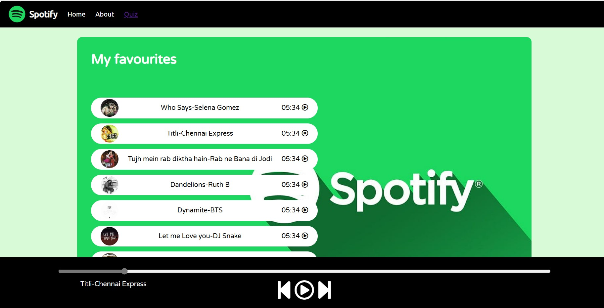
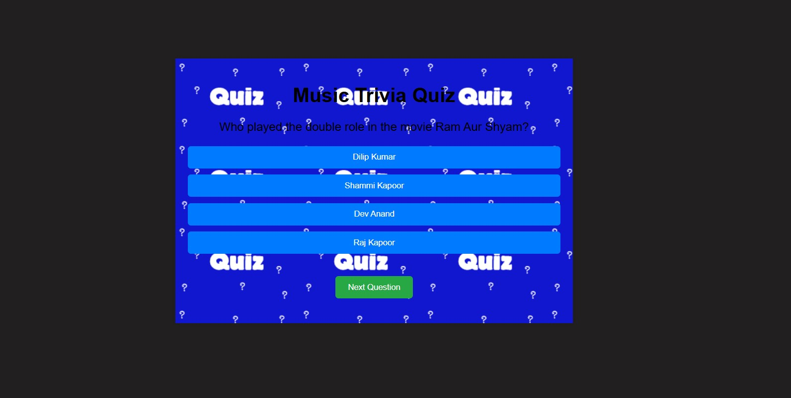

# Spotify Clone App with Pop Quiz Feature

Welcome to the Spotify Clone App! This application mimics the basic functionality of Spotify and introduces an innovative pop quiz feature to enhance user engagement.

## Table of Contents
- [Features](#features)
- [Screenshots](#screenshots)
- [Installation](#installation)
- [Usage](#usage)
- [Technologies Used](#technologies-used)
- [License](#license)
- [Acknowledgements](#acknowledgements)

## Features
- **Music Streaming**: Stream your favorite songs from a wide variety of genres.
- **Pop Quiz**: Test your music knowledge with fun, interactive quizzes.

## Screenshots



## Installation

### Prerequisites
- Node.js
- npm

### Steps
1. **Clone the repository**:
    ```sh
    git clone https://github.com/yourusername/spotify-clone-app.git
    ```
2. **Navigate to the project directory**:
    ```sh
    cd spotify-clone-app
    ```
3. **Install dependencies**:
    ```sh
    npm install
    ```
4. **Start the development server**:
    ```sh
    npm start
    ```

## Usage
1. **Launch the app**:
    Open your web browser and navigate to `http://localhost:3000`.
2. **Explore Music**:
    Browse, search, and play songs.
3. **Take a Quiz**:
    Go to the Quiz section and test your knowledge on various music-related questions. Earn badges and rewards based on your performance.

## Technologies Used
- **Frontend**:
  - HTML, CSS, JavaScript 
## License
This project is licensed under the MIT License - see the [LICENSE](LICENSE) file for details.

## Acknowledgements
- Inspired by [Spotify](https://www.spotify.com).
- Thanks to the contributors and the open-source community for their support.

